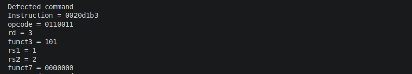
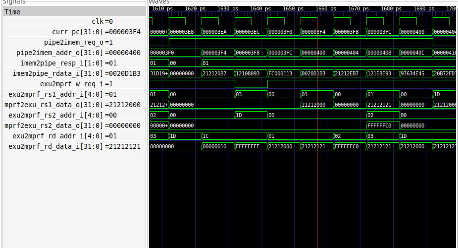

#   Lab3

В ходе лабораторной работы изучен и модифицирован TB открытого ядра SCR1 с архитектурой RISC-V.

В соответствии с вариантом задания проделана следующая работа:

1. С исходным кодом собрана симуляционная модель с одним тестом (srl.S) с помощью команды:

>make run_verilator_wf TARGETS="riscv_isa

По сообщению из log подтверждена работоспособность модели ("Test passed").

2. Создан несинтезируемый блок scr1_my_tb() для верификационного окружения scr1.Модуль scr1_my_tb() отслеживает выполнение команды srl и в случае её обнаружения выводит отладочную информацию:

>"Detected command"

>Instruction

>opcode

>rd

>funct3

>rs1

>rs2

>funct7

Рисунок с отладочная информация представлена ниже:

3. Модуль подключен в файл scr1_top_tb_ahb.sv.  

4. В GTKWave выведена диаграмма с сигналами представленными на рисунке ниже:

